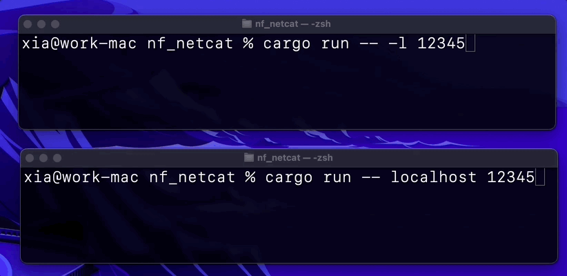

# nf_netcat

Rust port of the sample code [Implementing netcat with Network Framework](https://developer.apple.com/documentation/network/implementing_netcat_with_network_framework),
a quick and dirty hack, full of compiler warnings.

The project aims to demonstrate that it's achievable to create a networking program in Rust with Network Framework.
In other words, to prove that we can access the framework through its Objective-C (particularly [Blocks](https://clang.llvm.org/docs/Block-ABI-Apple.html)) interface.

This port supports UDP only and must be run on macOS.

# Quick start

To run as a server (listening for an inbound connection),
you supply the -l option and the port number to listen on:

```
cargo run -- -l 12345
```

To run as a client (making an outbound connection), you supply the IP and the port:

```
cargo run -- localhost 12345
```

# Demo

A chat session:


